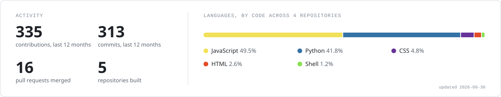

<div align="center">

<picture>
  <source media="(prefers-color-scheme: dark)" srcset="examples/hero-dark.svg">
  
</picture>

<br><br>

**Your name, drawn in GitHub contribution squares, plus stats, language and stack cards for your profile README.**<br>
One GitHub Action. Plain SVG files committed to your repo. No third-party servers to go down or rate-limit you.

</div>

<br>

## Why

The public stats services most profiles rely on share one API quota between thousands of users, and when it runs out your README shows broken images. The original `github-readme-stats` instance was paused in 2026 for exactly that reason.

This action draws the cards inside your own workflow, with your own token, and commits them next to your README. They render as long as GitHub does.

## What you get

<table>
<tr><td><b>hero</b></td><td>Your name in a 5x7 pixel font made of contribution cells, drawn at double size when it fits. A title, a tagline that types itself out, and a footer line. Animated, and it respects <code>prefers-reduced-motion</code>.</td></tr>
<tr><td><b>stats</b></td><td>Contributions and commits over the last 12 months, merged pull requests, repositories, and a language breakdown by code size, with duplicate repos counted once.</td></tr>
<tr><td><b>stack</b></td><td>A row of <a href="https://simpleicons.org">Simple Icons</a> logos in one ink colour, so it reads as a set and not as logo soup.</td></tr>
</table>

Every card comes in a dark and a light version and carries a `<title>` and `<desc>` for screen readers.

<picture>
  <source media="(prefers-color-scheme: dark)" srcset="examples/stats-dark.svg">
  
</picture>

<picture>
  <source media="(prefers-color-scheme: dark)" srcset="examples/stack-dark.svg">
  
</picture>

A short name gets the full double-size treatment. This is the header on [github.com/Yog-Rajja](https://github.com/Yog-Rajja):

<picture>
  <source media="(prefers-color-scheme: dark)" srcset="examples/yog-rajja-dark.svg">
  
</picture>

## Setup

**1.** In your profile repository (the one named after your username), add `.github/workflows/pixel-profile.yml`:

```yaml
name: Pixel profile

on:
  schedule:
    - cron: "0 2 * * *" # daily
  workflow_dispatch:

permissions:
  contents: write

jobs:
  cards:
    runs-on: ubuntu-latest
    steps:
      - uses: actions/checkout@v7

      - uses: Yog-Rajja/pixel-profile@v1
        with:
          token: ${{ secrets.PROFILE_TOKEN || github.token }}
          title: Backend engineer
          tagline: Building boring, reliable systems.
          footer: example.com  ·  @you
          stack: go,postgresql:Postgres,docker,kubernetes,githubactions:Actions

      - run: |
          git config user.name "github-actions[bot]"
          git config user.email "41898282+github-actions[bot]@users.noreply.github.com"
          git add assets
          git diff --cached --quiet || (git commit -m "Refresh profile cards" && git push)
```

**2.** Run it once from the Actions tab, then put the cards in your `README.md`:

```html
<picture>
  <source media="(prefers-color-scheme: dark)" srcset="assets/hero-dark.svg">
  
</picture>
```

Do the same for `stats` and `stack`.

**3. Optional:** `github.token` only sees public repositories. For private repos to count in the language breakdown, create a [personal access token](https://github.com/settings/tokens) with the `repo` scope and save it as a secret named `PROFILE_TOKEN`. Also turn on **Include private contributions on my profile** in your GitHub profile settings, so the contribution numbers include private work.

## Inputs

| Input | Default | What it does |
| --- | --- | --- |
| `token` | required | Token used to read your data. |
| `login` | repository owner | Whose profile to draw. |
| `name` | your display name | Text for the pixel header: A to Z, spaces and hyphens. |
| `title` | none | Bold line under the name. |
| `tagline` | none | Monospace line that types itself out. |
| `footer` | none | Small line at the bottom of the header. |
| `stack` | none | Comma list of Simple Icons slugs, each optionally `:Label`. |
| `cards` | `hero,stats,stack` | Which cards to draw. |
| `output_dir` | `assets` | Where to write the SVGs. |

Leave out `title`, `tagline` and `footer` and the header shrinks to just the name.

## Run it locally

```bash
GH_TOKEN=$(gh auth token) PROFILE_LOGIN=your-name HERO_TITLE="Hello" node src/build.mjs
DRY_RUN=1 GH_TOKEN=$(gh auth token) PROFILE_LOGIN=your-name node src/build.mjs   # numbers only
```

It needs Node 20+ and has no dependencies.

## Licence

MIT. If you use it, a star helps other people find it.
